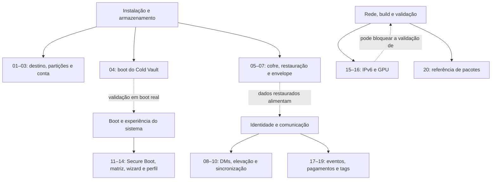

# Neovanguard — walkthrough dos erros por causa e efeito

Análise concluída em **16/09/2026**, sobre a árvore da versão **1.2.1 em preparação**, commit `619d7697bf9ff0067a0d314c6456a5183f7a733b` (merge do PR #7). A auditoria começou em 15/09, com a árvore limpa. Nenhum fonte de produção foi alterado: esta pasta contém somente relatórios, provas e registros da revisão.

A análise confirmou **20 novos erros, NVG-13 a NVG-32**. Cada relatório acompanha a entrada ou ação que expõe o problema, a origem do defeito, sua propagação e o efeito observado ou esperado. As provas usam funções reais, CLIs, cópias temporárias, respostas externas simuladas e tráfego isolado; não foram usados discos, contas, chaves, pagamentos, firmware ou firewall reais.

## Estado das correções (atualizado em 18/09/2026)

**Os 12 erros anteriores, NVG-01 a NVG-12, permanecem corrigidos dentro do escopo verificável desta revisão.** A conferência individual e as ressalvas sobre outras correções anunciadas estão em [correções verificadas](correcoes-verificadas.md).

**Três dos 20 achados foram corrigidos, testados nas respectivas branches e integrados à main: NVG-29, NVG-30 e NVG-17.** O [registro de 18/09](correcoes-2026-09-18.md) reúne os commits, PRs e resultados. Os outros 17 continuam pendentes neste acompanhamento. A validação conjunta após os merges e os testes de ISO/VM ainda não foram realizados; consulte as [pendências de validação](pendencias-iso-vm-hardware.md).

Prioridade de tratamento: aplicação privilegiada do cofre (NVG-17), autenticidade e valor em pagamentos (NVG-29/30), seleção destrutiva e restauração no instalador (NVG-13/14/15/18), boot e isolamento solicitado (NVG-16/23/25). A gravidade considera a consequência no cenário descrito, não uma pontuação CVSS nem a frequência de ocorrência.

## Ordem de leitura e lista de erros

| Cadeia | Erro | O que dá errado | Impacto | Estado |
|---|---|---|---|---|
| [01 — Mídia Live como destino](NVG-13-particao-da-midia-live.md) | NVG-13 | Partições da própria mídia Live são aceitas como destino manual | Alto | **Pendente** |
| [02 — Partições sobrepostas](NVG-14-raiz-esp-home-sobrepostas.md) | NVG-14 | A mesma partição pode ser raiz, ESP e home | Alto | **Pendente** |
| [03 — Usuário reservado](NVG-15-usuario-reservado.md) | NVG-15 | `root` é aceito como nova conta e a instalação falha depois da formatação | Alto | **Pendente** |
| [04 — Boot do Cold Vault](NVG-16-boot-vault-perde-parametros.md) | NVG-16 | A entrada perde parâmetros necessários para Btrfs e LUKS | Alto | **Pendente** |
| [05 — Links no cofre](NVG-17-cofre-links-no-destino.md) | NVG-17 | Aplicação privilegiada segue links no home e no temporário | Alto | Corrigido — [PR #8](https://github.com/NEOpisa/neovanguard-os-dev/pull/8) |
| [06 — Restauração sem filtros](NVG-18-restauracao-instalador-sem-filtros.md) | NVG-18 | O instalador ignora a lista de arquivos permitidos | Alto | **Pendente** |
| [07 — Envelope não autenticado](NVG-19-envelope-causa-panic.md) | NVG-19 | Um tamanho não autenticado pode abortar o processo | Médio | **Pendente** |
| [08 — Limpeza de DMs](NVG-20-limpeza-dms-nao-publica.md) | NVG-20 | A interface anuncia envio sem publicar pedidos de exclusão | Médio | **Pendente** |
| [09 — Elevação e argumentos](NVG-21-elevacao-perde-argumentos.md) | NVG-21 | Flash e transportes mesh perdem a ação ao executar `sudo` | Médio | **Pendente** |
| [10 — Sincronização offline](NVG-22-sync-ignora-eventos-offline.md) | NVG-22 | Eventos offline antigos deixam de ser publicados | Médio | **Pendente** |
| [11 — Secure Boot](NVG-23-secureboot-sucesso-falso.md) | NVG-23 | O setup anuncia uma cadeia assinada após falha | Alto | **Pendente** |
| [12 — Matriz de aço](NVG-24-matriz-24-palavras-cortada.md) | NVG-24 | A matriz para 24 palavras ultrapassa a página | Médio | **Pendente** |
| [13 — Menu do primeiro boot](NVG-25-wizard-captura-menu.md) | NVG-25 | O assistente captura o menu junto com a resposta | Alto | **Pendente** |
| [14 — Perfil divergente](NVG-26-perfil-gravado-nao-lido.md) | NVG-26 | O perfil é gravado em arquivo e chave diferentes dos lidos | Médio | **Pendente** |
| [15 — VPN e IPv6](NVG-27-vpn-ipv6-sem-ndp.md) | NVG-27 | O kill-switch impede o endpoint quando o cache NDP esvazia | Médio | **Pendente** |
| [16 — Teste dependente de GPU](NVG-28-teste-depende-da-gpu.md) | NVG-28 | O teste do manifesto falha em hosts NVIDIA e bloqueia o check | Médio | **Pendente** |
| [17 — Evento Nostr forjado](NVG-29-rpc-aceita-evento-forjado.md) | NVG-29 | O cliente aceita perfil com hash e assinatura inválidos | Alto | Corrigido — [PR #9](https://github.com/NEOpisa/neovanguard-os-dev/pull/9) |
| [18 — Valor do zap](NVG-30-zap-nao-confere-valor.md) | NVG-30 | O valor da fatura não é comparado aos sats solicitados | Alto | Corrigido — [PR #10](https://github.com/NEOpisa/neovanguard-os-dev/pull/10) |
| [19 — Tags descartadas](NVG-31-assinatura-descarta-tags.md) | NVG-31 | A CLI ignora `--tag` e envia evento sem referências | Médio | **Pendente** |
| [20 — Verificador de pacotes](NVG-32-verificador-pacotes-falso-alarme.md) | NVG-32 | Um conflito do host produz diagnóstico de pacote inexistente | Baixo | **Pendente** |

## Mapa dos pontos de toque

As cadeias 01 a 07 atravessam instalação, boot, armazenamento e cofre. As cadeias 08 a 10 e 17 a 19 tratam identidade, comunicação Nostr e pagamentos. As cadeias 11 a 14 cobrem inicialização e experiência do usuário; 15, 16 e 20 cobrem rede e mecanismos de build ou verificação. As setas pontilhadas indicam relação entre áreas, não dependência obrigatória entre os defeitos.

## Evidências e limites

- **Rust:** 182 testes existentes passaram e 1 falhou, em 183 execuções distintas. A falha dependente da GPU do host é o NVG-28. `fmt` e Clippy do workspace passaram.
- **Python e rede:** 103 testes existentes passaram, incluindo 10 testes de tráfego em namespaces descartáveis. Quatro políticas nft e suas sondas de estado passaram.
- **Qt e systemd:** 14 resultados Qt foram aprovados em modo offscreen. O teste adicional da política systemd passou para IPC, sockets IP, home somente leitura e NIP-46.
- **Sintaxe:** 84 arquivos Bash/PKGBUILD, 37 Python e 10 JSON próprios passaram nas verificações aplicáveis.
- **Provas dos novos erros:** seis testes Rust adicionais e provas com funções, scripts e CLIs reais reproduziram os achados. Nessas provas, um teste aprovado significa que o defeito foi observado, não que foi corrigido.
- **ISO:** os perfis e verificações estáticas foram exercitados, mas `./build-iso --check` não teve aprovação integral e nenhuma ISO foi construída ou certificada.

Os comandos, logs e instruções de reprodução estão no [registro de evidências](evidencias/README.md). A matriz de [pendências de ISO, VM e hardware](pendencias-iso-vm-hardware.md) define os cenários que continuam necessários.

O escopo incluiu instalação, disco, contas, boot, cofre, configurações, identidade Nostr, agente e IPC, utilitários `neo-*`, políticas de rede, assistente inicial, build, empacotamento, workflows e integração visual. Não houve auditoria linha a linha de dependências vendorizadas, Arch/AUR ou kernel. Este trabalho documenta erros confirmados e validações realizadas; **não certifica a ISO, a segurança integral do sistema nem a ausência de outros problemas**.
