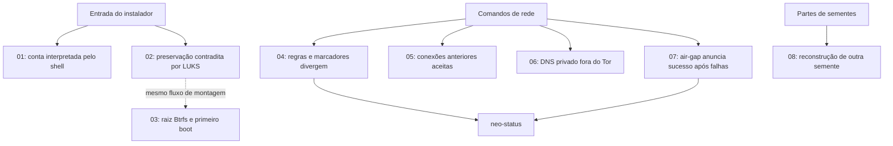

# Neovanguard — walkthrough dos erros por causa e efeito

Análise de **09/09/2026**, sobre a árvore local da versão **1.2.0 em preparação**, commit `9bb3e666e938aa8c7ac746eed7a5ea69f11b46d4`. A árvore estava sem alterações no início. Foram acrescentados somente estes documentos.

São **9 erros em 8 cadeias**. Cada arquivo acompanha a entrada ou ação do usuário, a origem do defeito, sua propagação e o efeito observável ou esperado. Os links entre cadeias distinguem dependência de execução de semelhança de diagnóstico. Não há propostas de correção.

## Estado após a primeira rodada de correções

**NVG-03, NVG-02 e NVG-01 corrigidos no código-fonte**, nessa prioridade. Os seis demais achados permanecem pendentes. Consulte o [registro da rodada](correcoes-01.md) para comportamento atual e validação. Os walkthroughs abaixo preservam o diagnóstico da revisão original; suas linhas se referem ao commit auditado.

## Ordem de leitura e lista de erros

| Cadeia | Erros | O que dá errado | Impacto |
|---|---|---|---|
| [01 — Conta e shell](01-conta-interpretada-pelo-shell.md) | NVG-01, NVG-02 | Apóstrofo na senha quebra o script; dados da conta podem ser interpretados como comandos | Alto |
| [02 — Preservação e LUKS](02-preservacao-e-luks.md) | NVG-03 | Raiz anunciada como mantida recebe criação destrutiva de contêiner | Crítico |
| [03 — Btrfs e boot](03-btrfs-e-primeiro-boot.md) | NVG-04 | Entrada systemd-boot não seleciona o subvolume que contém o sistema | Alto |
| [04 — Firewall e painel](04-firewall-e-painel.md) | NVG-05 | Painel pode anunciar Tor após retorno ao firewall de saída direta | Alto |
| [05 — Conexões anteriores](05-conexoes-anteriores-ao-bloqueio.md) | NVG-06 | Sessões diretas estabelecidas continuam aceitas | Alto |
| [06 — DNS e LAN](06-dns-fora-do-tor.md) | NVG-07 | Consulta ao resolvedor privado evita o redirecionamento Tor | Alto |
| [07 — Air-gap](07-airgap-sucesso-sem-isolamento.md) | NVG-08 | Falhas de isolamento terminam com marcador e mensagem de sucesso | Alto |
| [08 — Recuperação Shamir](08-shamir-recuperacao-de-outra-semente.md) | NVG-09 | Mistura de conjuntos gera outra semente com checksum válido | Alto |

A gravidade expressa a consequência no cenário descrito, não a frequência de ocorrência.

## Mapa dos pontos de toque

As cadeias 01 a 03 atravessam a instalação. As cadeias 04 a 07 atravessam os comandos de rede e o diagnóstico. A cadeia 08 acompanha a recuperação de uma semente e não depende dos erros de rede.

## Evidências e limites

- **Reprodução isolada:** NVG-01/02, NVG-05 e NVG-08. Foram usados Bash, campos fictícios, comandos simulados e diretórios temporários. Nenhuma instalação, formatação ou alteração real de firewall foi executada.
- **Funções reais em memória:** NVG-09, usando dados e lista de palavras sintéticos. Nenhuma chave pessoal foi acessada.
- **Análise de fluxo:** NVG-03. A chamada destrutiva é explícita; não foi executada em disco.
- **Análise de código e semântica documentada:** NVG-04, NVG-06 e NVG-07. Os documentos identificam as consequências inferidas. Não houve boot em VM nem captura de tráfego.
- **Verificação existente:** `python3 scripts/test-build-deps.py` passou, 1 teste.
- **Suíte Rust:** `cargo test --locked --offline --workspace` completou os 59 testes do instalador sem falhas. No módulo seguinte, 55 testes registraram sucesso, mas `rede::testes::ida_e_volta_num_relay_local` permaneceu em execução por mais de 60 segundos. A execução foi interrompida; **não há resultado de aprovação da suíte completa**. Essa demora não foi classificada como erro da distro, pois sua causa não foi determinada.

O escopo foi a árvore-fonte do instalador, os comandos e regras de rede relacionados aos achados e a recuperação Shamir, com leitura dos pontos de integração. Não houve auditoria exaustiva de todos os aplicativos, dependências, pacotes binários e imagens. Os arquivos gerados não afirmam que estes sejam todos os erros existentes.

As referências locais apontam para arquivos e linhas da árvore analisada. As referências externas, presentes nas cadeias 03, 05 e 06, documentam a semântica usada na interpretação.

