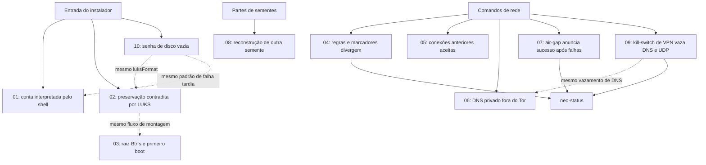

# Neovanguard — walkthrough dos erros por causa e efeito

Análise de **09/09/2026**, sobre a árvore local da versão **1.2.0 em preparação**, commit `9bb3e666e938aa8c7ac746eed7a5ea69f11b46d4`. A árvore estava sem alterações no início. Foram acrescentados somente estes documentos.

A análise original encontrou **9 erros em 8 cadeias**. A revisão de **11/09/2026**, feita depois das correções, acrescentou **3 erros em 2 cadeias** (09 e 10), no mesmo formato; ali as linhas citadas são as da árvore de 11/09. Cada arquivo acompanha a entrada ou ação do usuário, a origem do defeito, sua propagação e o efeito observável ou esperado. Os links entre cadeias distinguem dependência de execução de semelhança de diagnóstico. As cadeias descrevem o problema; o que foi corrigido está nas seções "Solução aplicada" e nos registros de rodada.

## Estado das correções (reconciliado em 11/09/2026)

**As oito cadeias originais estão corrigidas no código.** NVG-01 a NVG-04 foram corrigidos no commit `3e0b344`. NVG-05 a NVG-08 foram corrigidos nos PRs #1, #2 e #3 do `neovanguard-os-dev`, que chegaram à `main` pelo PR #4. Onde houve duas correções para o mesmo erro (NVG-05), prevaleceu a do `neovanguard-os-dev`. O NVG-09 foi corrigido na quinta rodada.

**As dez cadeias estão corrigidas no código.** NVG-10, NVG-11 e NVG-12 foram resolvidos na [sexta rodada](correcoes-06.md). A lista completa do que falta, inclusive o que não é código, está em [reconciliação](reconciliacao-2026-09-11.md#o-que-falta-corrigir).

Registros: [primeira](correcoes-01.md), [segunda](correcoes-02.md), [terceira (substituída)](correcoes-03.md), [quarta](correcoes-04.md), [quinta](correcoes-05.md) e [sexta](correcoes-06.md) rodadas. A comparação entre esta pasta, o repositório NVG-OS-DEBUG e o `neovanguard-os-dev`, com o inventário do trabalho local que estava fora do git, está em **[reconciliação](reconciliacao-2026-09-11.md)**.

Os nomes dos arquivos dizem o estado: `✅` resolvido, `❌` pendente. Os walkthroughs preservam o diagnóstico original; as linhas citadas neles são as do commit auditado.

## Ordem de leitura e lista de erros

| Cadeia | Erros | O que dá errado | Impacto | Estado |
|---|---|---|---|---|
| [01 — Conta e shell](✅-01-conta-interpretada-pelo-shell.md) | NVG-01, NVG-02 | Apóstrofo na senha quebra o script; dados da conta podem ser interpretados como comandos | Alto | **Resolvido** (`3e0b344`) |
| [02 — Preservação e LUKS](✅-02-preservacao-e-luks.md) | NVG-03 | Raiz anunciada como mantida recebe criação destrutiva de contêiner | Crítico | **Resolvido** (`3e0b344`) |
| [03 — Btrfs e boot](✅-03-btrfs-e-primeiro-boot.md) | NVG-04 | Entrada systemd-boot não seleciona o subvolume que contém o sistema | Alto | **Resolvido** (`3e0b344`) |
| [04 — Firewall e painel](✅-04-firewall-e-painel.md) | NVG-05 | Painel pode anunciar Tor após retorno ao firewall de saída direta | Alto | **Resolvido** (PR #3) |
| [05 — Conexões anteriores](✅-05-conexoes-anteriores-ao-bloqueio.md) | NVG-06 | Sessões diretas estabelecidas continuam aceitas | Alto | **Resolvido** (PR #1) |
| [06 — DNS e LAN](✅-06-dns-fora-do-tor.md) | NVG-07 | Consulta ao resolvedor privado evita o redirecionamento Tor | Alto | **Resolvido** (PR #1) |
| [07 — Air-gap](✅-07-airgap-sucesso-sem-isolamento.md) | NVG-08 | Falhas de isolamento terminam com marcador e mensagem de sucesso | Alto | **Resolvido** (PR #3) |
| [08 — Recuperação Shamir](✅-08-shamir-recuperacao-de-outra-semente.md) | NVG-09 | Mistura de conjuntos gera outra semente com checksum válido | Alto | **Resolvido** (5ª rodada) |
| [09 — Kill-switch de VPN](✅-09-killswitch-vpn-saidas-fora-do-tunel.md) | NVG-10, NVG-11 | DNS para o resolvedor da LAN sai fora do túnel; UDP 51820/1194 sai para qualquer host | Alto / Médio | **Resolvido** (6ª rodada) |
| [10 — Senha de disco vazia](✅-10-senha-de-disco-vazia.md) | NVG-12 | Criptografia com senha vazia passa na validação, e o `luksFormat` falha depois de o disco ser apagado | Alto | **Resolvido** (6ª rodada) |

A gravidade expressa a consequência no cenário descrito, não a frequência de ocorrência.

## Mapa dos pontos de toque

As cadeias 01 a 03 e 10 atravessam a instalação. As cadeias 04 a 07 e 09 atravessam os comandos de rede e o diagnóstico. A cadeia 08 acompanha a recuperação de uma semente e não depende dos erros de rede.

## Evidências e limites

- **Reprodução isolada:** NVG-01/02, NVG-05 e NVG-08. Foram usados Bash, campos fictícios, comandos simulados e diretórios temporários. Nenhuma instalação, formatação ou alteração real de firewall foi executada.
- **Funções reais em memória:** NVG-09, usando dados e lista de palavras sintéticos. Nenhuma chave pessoal foi acessada.
- **Análise de fluxo:** NVG-03. A chamada destrutiva é explícita; não foi executada em disco.
- **Análise de código e semântica documentada:** NVG-04, NVG-06 e NVG-07. Os documentos identificam as consequências inferidas. Não houve boot em VM nem captura de tráfego.
- **Verificação existente:** `python3 scripts/test-build-deps.py` passou, 1 teste.
- **Suíte Rust:** `cargo test --locked --offline --workspace` completou os 59 testes do instalador sem falhas. No módulo seguinte, 55 testes registraram sucesso, mas `rede::testes::ida_e_volta_num_relay_local` permaneceu em execução por mais de 60 segundos. A execução foi interrompida; **não há resultado de aprovação da suíte completa**. Essa demora não foi classificada como erro da distro, pois sua causa não foi determinada.

Revisão de 11/09/2026:

- **Tráfego real em namespaces descartáveis:** NVG-10 e NVG-11, com a interface do túnel simulada por uma `dummy` e o mecanismo de `scripts/test-nft-network.py`. Nenhuma regra foi carregada no firewall da máquina.
- **Comportamento medido do `cryptsetup`:** NVG-12, numa imagem de arquivo de 32 MB, sem root e sem disco real.
- **Suíte completa:** o `./check` rodou 183 testes do workspace, inclusive `ida_e_volta_num_relay_local`, e terminou com `build-iso --check` aprovado.
- **CI anterior:** a `main` do `neovanguard-os-dev` estava vermelha desde os PRs de rede, só no passo do `check-network-policies.py`; a [quinta rodada](correcoes-05.md) corrige a causa. O resultado remoto da publicação é registrado no PR correspondente.
- **Olhados e sem defeito:** `tor.nft` e `killswitch-tor.nft` depois do PR #1; passagem da senha do disco e da conta pela entrada padrão; compatibilidade das partes `nvgs1` geradas pelo código antigo (200 casos).

O escopo foi a árvore-fonte do instalador, os comandos e regras de rede relacionados aos achados e a recuperação Shamir, com leitura dos pontos de integração. Não houve auditoria exaustiva de todos os aplicativos, dependências, pacotes binários e imagens. Os arquivos gerados não afirmam que estes sejam todos os erros existentes.

As referências locais apontam para arquivos e linhas da árvore analisada. As referências externas, presentes nas cadeias 03, 05 e 06, documentam a semântica usada na interpretação.
